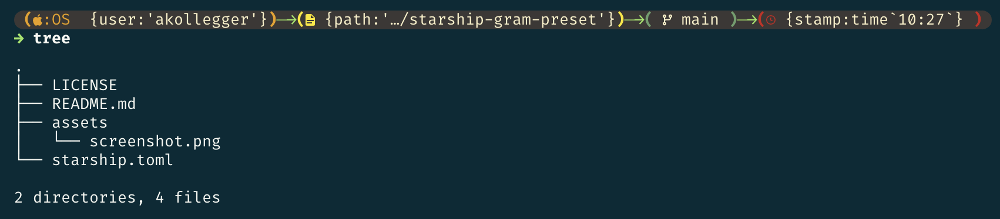

<p align="center">
	<a href="https://github.com/gram-data/starship-gram-preset/stargazers"></a>
	<a href="https://github.com/gram-data/starship-gram-preset/issues"></a>
	<a href="https://github.com/gram-data/starship-gram-preset/contributors"></a>
</p>

# starship-gram-preset

[Starship](https://starship.rs) preset using gram notation.

<p align="center">
	
</p>

## Install

Download the theme and set it as your Starship config.

   ```shell
   mkdir -p ~/.config && curl -o ~/.config/starship.toml \https://raw.githubusercontent.com/gram-data/starship-gram-preset/main/starship.toml
   ```